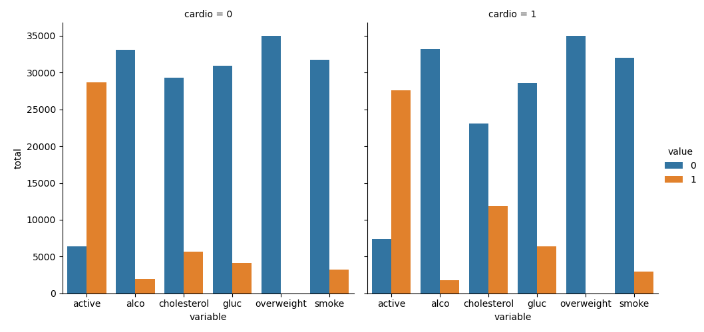

# Project Notes

Measured Variables: Numerical, able to be operated upon using mathematical operators.

Identifier Variables: Typically word-based i.e. names, subjects, categories, etc.

 

---

 

 

---

 

 

