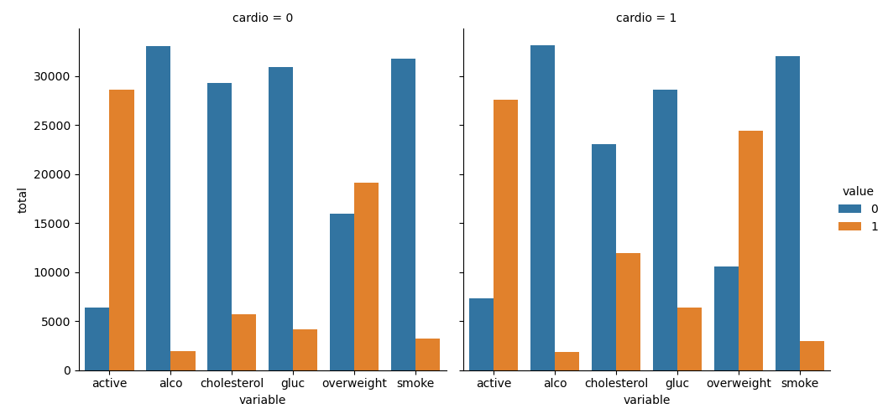

# Project Notes

Measured Variables: Numerical, able to be operated upon using mathematical operators.

Identifier Variables: Typically word-based i.e. names, subjects, categories, etc.

 

---

## *Progress Update* *06/26/2024*

#: I've been able to successfully get everything to run. Each time I run main.py, both plots are rendered which creates image files for each plot that are saved to the project directory under catplot.png and heatmap.png respectively. However, though the resulting plots from my project are similar in appearance, the data points are slightly off.

#: If I can figure out how to correct the data points on my plots, I'll be able to finish this project relatively quickly with not much trouble.

 

 

---

 

 

