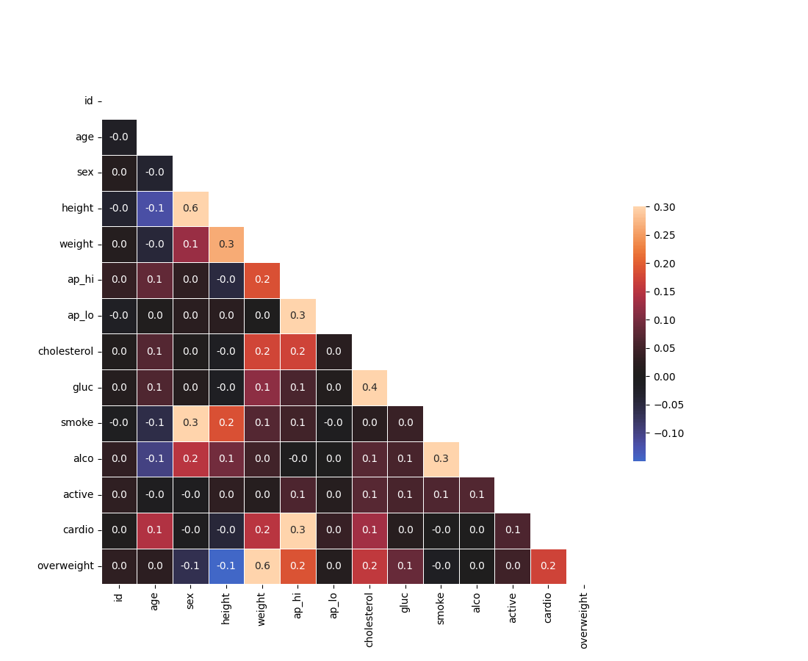

# Project Notes

Measured Variables: Numerical, able to be operated upon using mathematical operators.

Identifier Variables: Typically word-based i.e. names, subjects, categories, etc.

 

---

## *Progress Update* *06/26/2024*

I've been able to successfully get everything to run. Each time I run main.py, both plots are rendered which creates image files for each plot that are saved to the project directory under catplot.png and heatmap.png respectively. However, though the resulting plots from my project are similar in appearance, the data points are slightly off.

My last remaining task is to make the necessary adjustments so the data points on both plots match the example plots. Hopefully that won't be too difficult.

## Example:

 

 

---

## CatPlot Result:

 

 

## Example:

## Heat Map Result:

